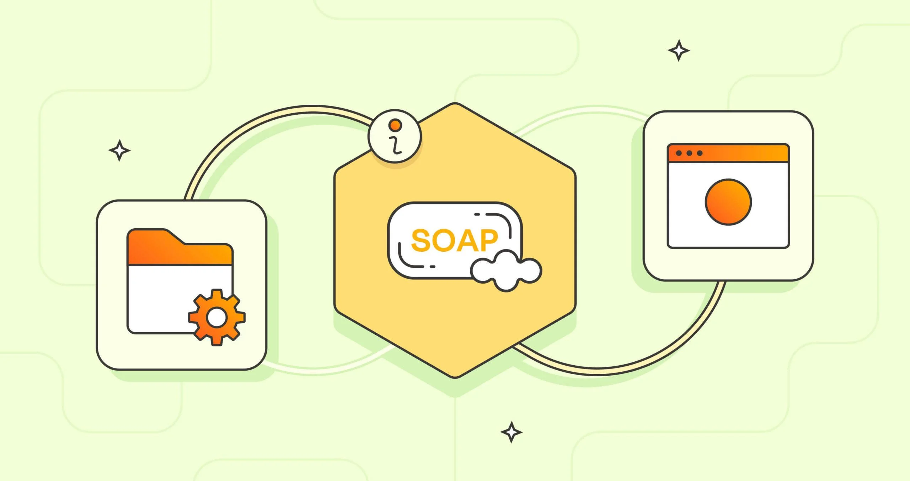
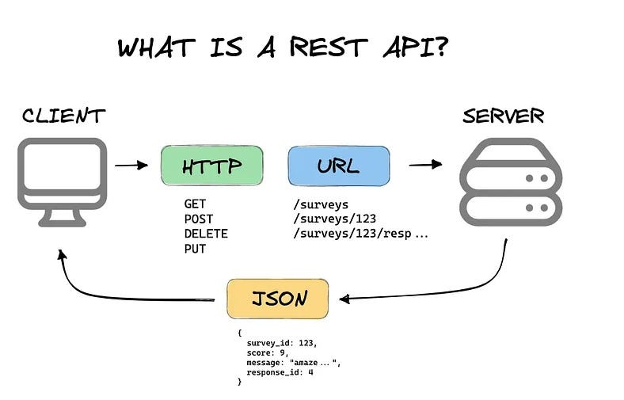
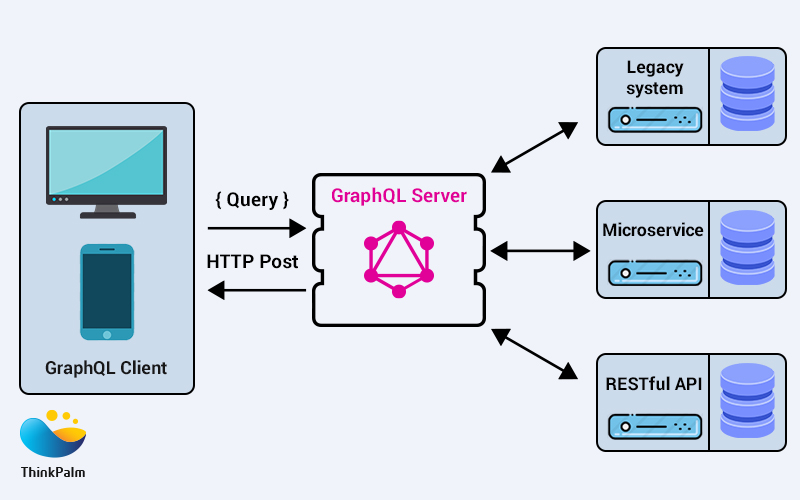
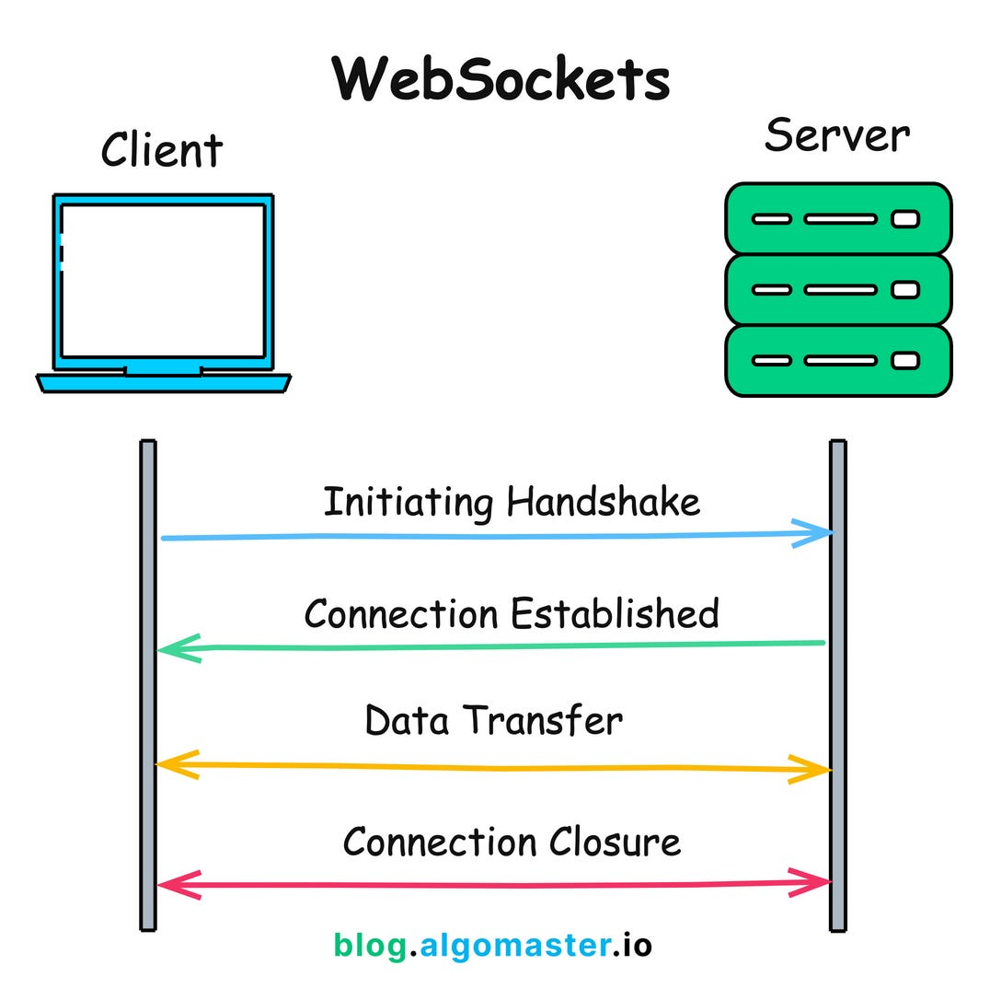

# API protocols - Architecture styles

## Overview

This document will briefly explain some api architecture styles on how the communication in between services is done by only using a general point in the middle.

Here are also listed the examples of applications in which these api architecture styles can be used for internal communication in between the services.

## Architecture Styles

In this article, there are 5 most used api styles that are used for different cases. On each of these api styles some type of applications are listed as examples that use these styles of internal communication.

### SOAP

SOAP lets applications that are running on different operating systems and in different programming languages communicate with each other.
 
SOAP uses XML messages to send in between 2 services client - server. 
 
XML is a markup language and file format for storing, transmitting, and reconstructing data.
 
SOAP standards are used in web applications where security and reliability is the key.

Example web app usage:
- Financial and Banking Services 
- Stock Trading Platforms
- Government and Public Sector Services
- Telecommunications and Networking
- Aerospace for booking flights, airtraffic control

### RESTful API

RESTful API is an architectural style for designing networked applications. It follows REST principles which are based on stateless communication in between a client and a server over the HTTP protocol.

RESTful API is used for frontend-backend that communicate via HTTP requests and responses.

RESTful API typically for data exchange uses JSon

RESTFul API standards are used in web applications where simplicity, scalability and statelessnes is the key

Example web app usage:
- E-commerce Platforms
- Social Media Platforms
- Content Management Systems
- Streaming Services

### GraphQL

GraphQL is a query language for APIs and a runtime for executing those queries by using a type system you define for your data

GraphQL enables clients to request only the data they need, which reduces the amount of data transferred over the network and can improve performance

GraphQL allows clients to retrieve data from multiple sources (microservices, databases, etc.) in a single request and operates over HTTP using a single endpoint

Example web app usage:
- Mobile Applications
- Streaming Applications

### Websocket
WebSocket is a communication protocol that enables real-time, bidirectional communication between a client and a server over a single connection

WebSocket operates over TCP and establishes a long-lived connection between the client and server

WebSocket eliminates the need for repeated HTTP requests by reducing overhead and improving performance in scenarios where data updates frequently

Example app usage:
- Real time chat applications (whatsapp slack)
- Stock market or frinancial trading platforms (financial transactions, stock prices)
- Live streaming and online gaming (real time even broadcasting such as Twitch)

## References

 - [API architecture styles](https://stoplight.io/api-types)
 - [GraphQL](https://graphql.org/learn/performance/)
 - [gRPC](https://grpc.io/docs/what-is-grpc/introduction/#overview)
 - [SOAP](https://help.salesforce.com/s/articleView?id=platform.integrate_what_is_api.htm&type=5)