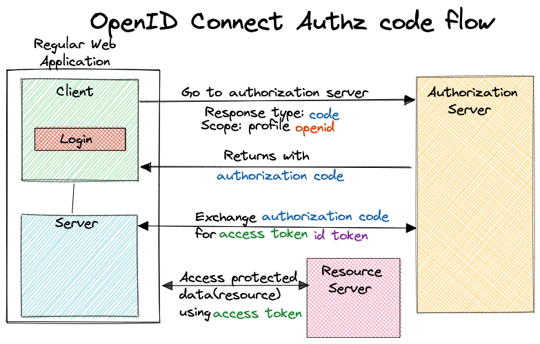

# Authentication Methods

## Overview

Authentication is a fundamental security process in software applications that ensures only authorized users can access systems, data and resources.

### OAuth2.0

OAuth 2.0 is an authorization framework that enables third-party applications to access user data without exposing credentials. It is used for SSO and API authorization.

How it works ?

- A user requests access to a resource.
- The application redirects the user to an Authorization Server.
- The user logs in and grants permission.
- The Authorization Server issues an access token.
- The application uses the token to access the resource.

#### Benefits

OAuth offers increased access control that allows users to grant third-party applications limited access to their accounts without sharing passwords or other sensitive information

Authorizing apps with OAuth is simple and straightforward.

It reduces the need to remember multiple usernames and passwords for different services which makes have improved User Experience.

It's a time saving solution for developers. It's simplifies the user authorization process which can be used to access multiple services without having to enter separate credentials each time.

OAuth authentication offers an abundance of flexibility and compatibility. It's widely adopted security protocol making it easy to implement across multiple platforms. Customizes the authorization process based on needs

### OpenID Connect

OpenID Connect is an identity authentication protocol that is an extension of open authorization OAuth2.0 to standardize the process for authenticating and authorizing users when they sign in to access digital services. OIDC provides authentication, which means verifying that users are who they say they are. OAuth2.0 authorizes which systems those users are allowed to access. OAuth2.0 is typically used to enable two unrelated applications to share information without compromising user data.

How it works?

- Uses OAuth 2.0 to authenticate users.
- Issues an ID Token (JWT) that contains user identity details.
- Applications use this token to verify users.

#### Benefits

OIDC is a standard protocol that can work with any application. With OpenID Connect, you can define how to implement authentication and display authentication results to the client.

Makes data interchange simple and transparent. 

Built on OAuth, which provides robust API access. OIDC provides additional data to enable the client to see who has logged in and with what level of access, something that makes user management easier.

SSO for cross-platform apps.

## References

 - [OAuth2.0](https://datatracker.ietf.org/doc/html/rfc6749)
 - [OIDC](https://openid.net/developers/how-connect-works/)
 - [v2 protocols](https://learn.microsoft.com/en-us/entra/identity-platform/v2-protocols)

